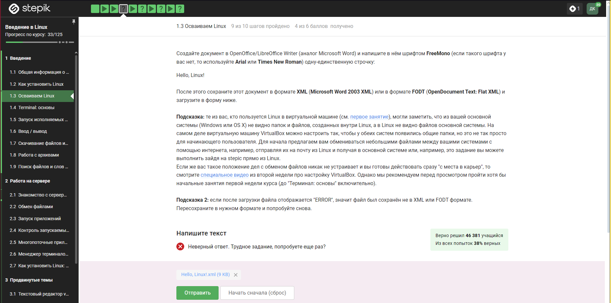
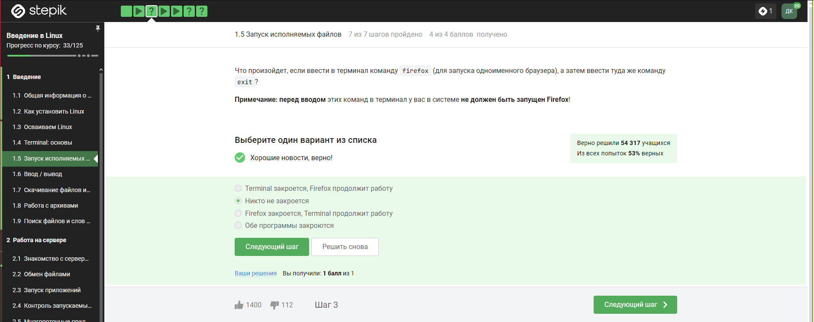

---
## Front matter
title: "Отчет по внешнему курсу"
subtitle: ""
author: "Казазаев Даниил Михайлович"

## Generic otions
lang: ru-RU
toc-title: "Содержание"

## Bibliography
bibliography: bib/cite.bib
csl: pandoc/csl/gost-r-7-0-5-2008-numeric.csl

## Pdf output format
toc: true # Table of contents
toc-depth: 2
lof: true # List of figures
lot: true # List of tables
fontsize: 12pt
linestretch: 1.5
papersize: a4
documentclass: scrreprt
## I18n polyglossia
polyglossia-lang:
  name: russian
  options:
	- spelling=modern
	- babelshorthands=true
polyglossia-otherlangs:
  name: english
## I18n babel
babel-lang: russian
babel-otherlangs: english
## Fonts
mainfont: PT Serif
romanfont: PT Serif
sansfont: PT Sans
monofont: PT Mono
mainfontoptions: Ligatures=TeX
romanfontoptions: Ligatures=TeX
sansfontoptions: Ligatures=TeX,Scale=MatchLowercase
monofontoptions: Scale=MatchLowercase,Scale=0.9
## Biblatex
biblatex: true
biblio-style: "gost-numeric"
biblatexoptions:
  - parentracker=true
  - backend=biber
  - hyperref=auto
  - language=auto
  - autolang=other*
  - citestyle=gost-numeric
## Pandoc-crossref LaTeX customization
figureTitle: "Рис."
tableTitle: "Таблица"
listingTitle: "Листинг"
lofTitle: "Список иллюстраций"
lotTitle: "Список таблиц"
lolTitle: "Листинги"
## Misc options
indent: true
header-includes:
  - \usepackage{indentfirst}
  - \usepackage{float} # keep figures where there are in the text
  - \floatplacement{figure}{H} # keep figures where there are in the text
---

# Цель работы

Пройти внешний курс и ознакомиться с темами, которые в нем представлены.

# Задание

Осзнакомится с информацией и прйоти внешний курс "Введение в Linux" на сайте Stepik.

# Выполнение заданий внешнего курса

## Этап первый

* Задание 1.1

Так как курс называется "Введение в Linux", выбираю этот ответ и иду дальше. (рис. [-@fig:001]).

{#fig:001 width=85%}

* Задание 1.2

Читаю критерии прохождения курса и выбираю соответсвующие ответы. (рис. [-@fig:002]).

{#fig:002 width=85%}

* Задание 1.3

Выбираю ОС, которой я пользуюсь чаще всего. (рис. [-@fig:003]).

{#fig:003 width=85%}

* Задание 1.4

Так как виртуальная программа это действительно программа для запукска одной ОС на другой ОС, выбираю этот ответ. (рис. [-@fig:004]).

{#fig:004 width=85%}

* Задание 1.5

Так как на протяжении всего года я иногда работал на Linux, отвечаю "Да". (рис. [-@fig:005]).

{#fig:005 width=85%}

* Задание 1.6

Не знаю, почему, но мой ответ не принимало, хотя я сделал все правильно. В текстовом файле я написал Hello, Linux! и сохранил файл как в формате XML, так и FODT, но как правильный ответ его не принимало. (рис. [-@fig:006]).

{#fig:006 width=85%}

* Задание 1.7

Установочные пакеты Ubuntu действительно имеют расширение deb, поэтому выбираю этот ответ. (рис. [-@fig:007]).

{#fig:007 width=85%}

* Задание 1.8

Фамилия автора Denis-Courmont. (рис. [-@fig:008]).

{#fig:008 width=85%}

Ищу имя автора программы VLC. (рис. [-@fig:009]).

{#fig:009 width=85%}

* Задание 1.9

Update Manager необходим для обновлений. (рис. [-@fig:010]).

{#fig:010 width=85%}

* Задание 1.10

Альтернативные названия командной строки - консоль и терминал. (рис. [-@fig:011]).

{#fig:011 width=85%}

* Задание 1.11

Команда pwd выводит на экран дирекеторию. (рис. [-@fig:012]).

{#fig:012 width=85%}

* Задание 1.12

{#fig:013 width=85%}

* Задание 1.13

Так как мы находимся в директории /home/bi/Docements, то нужно польность прописать директорию, которую мы хотим посмотреть. (рис. [-@fig:014]).

{#fig:014 width=85%}

* Задание 1.14

Для удалении директории используется команда rm -r, то есть удаление рекурсивно. (рис. [-@fig:015]).

{#fig:015 width=85%}

* Задание 1.15

Проверял это в ходе скрин каста, ничего не происходило. (рис. [-@fig:016]).

{#fig:016 width=85%}

* Задание 1.16

Запуск программы с & запускает ее в фоновом режиме. (рис. [-@fig:017]).

{#fig:017 width=85%}

* Задание 1.17

Файл программы выводит дату и некую сумму. (рис. [-@fig:018]).

{#fig:018 width=85%}

Запускаю программу в консоли Linux (рис. [-@fig:019]).

{#fig:019 width=85%}

* Задание 1.18

Ошибки выводятся на экран терминала. (рис. [-@fig:020]).

{#fig:020 width=85%}

* Задание 1.19

< file использует файл для ввода данных. file стандартный поток вывода в файл. 2>file - направляет стандартный поток ошибок в файл, если файл не существует, то он будет создан, если существует, то ошибка дописывается сверху. 2>>file - направляет стандартный поток ошибок в файл, если файл не существует, то он будет создан, если существует, то ошибка дописывается в конец файла.   (рис. [-@fig:021]).

{#fig:021 width=85%}

* Задание 1.20

Ошибки выводятся в на экран - в терминал. (рис. [-@fig:022]).

{#fig:022 width=85%}

* Задание 1.21

{#fig:023 width=85%}

* Задание 1.22

Чтобы wget не выводил текст в концоль можно использовать опцию -q или -quiet. (рис. [-@fig:024]).

{#fig:024 width=85%}

* Задание 1.23

{#fig:025 width=85%}

* Задание 1.24

{#fig:026 width=85%}

* Задание 1.25

{#fig:027 width=85%}

* Задание 1.26

Файл программы выводит дату и некую сумму.  (рис. [-@fig:028]).

c - архиватор

j - указатель на тип архиватора

f - создание архива в файловой системе

{#fig:028 width=85%}

* Задание 1.27

*.? - один символ из конца названия, alexey.* - маленькая буква, *.jpeg - не то расширение файла. (рис. [-@fig:029]).

{#fig:029 width=85%}

* Задание 1.28

Учитывается регистр букв и правильность написания. (рис. [-@fig:030]).

{#fig:030 width=85%}

* Задание 1.29

Делал задание на виртуальной машине. (рис. [-@fig:031]).

{#fig:031 width=85%}

{#fig:032 width=85%}

{#fig:033 width=85%}

Команда для выноса строк со словом love в отдельный файл

```
grep -r "love" //home/dmkazazaev/Загрузки/shakespeare > 1.txt
```

### Этап 2

* Задание 2.1

Все перечисленные ответы подходят. (рис. [-@fig:034]).

{#fig:034 width=85%}

* Задание 2.2

.pub - публичный. (рис. [-@fig:034]).

{#fig:035 width=85%}

* Задание 2.3

Подходит ответ с ключем -r, так как это копирования дериктории, а его нужно копировать рекурсивно. (рис. [-@fig:036]).

{#fig:036 width=85%}

* Задание 2.4

{#fig:037 width=85%}

* Задание 2.5

FileZilla — свободный многоязычный проект, посвящённый приложениям для FTP. Включает в себя отдельное приложение «FileZilla Client», и «FileZilla Server». Приложения публикуются с открытым исходным кодом для Windows, macOS и Linux. (рис. [-@fig:038]).

{#fig:038 width=85%}

* Задание 2.6

{#fig:039 width=85%}

* Задание 2.7

{#fig:040 width=85%}

* Задание 2.8

Мне не удалось установить FastQC, поэтому, недолго поискав в интернете, нашел правильный ответ. (рис. [-@fig:041]).

{#fig:041 width=85%}

* Задание 2.9

Команда, выполняющая множественное выравнивание clustalw test.fasta -align. (рис. [-@fig:042]).

{#fig:042 width=85%}

* Задание 2.10

Ctrl + C завершает процесс Ctr + Z приостанавливает процесс. (рис. [-@fig:043]).

{#fig:043 width=85%}

* Задание 2.11

{#fig:044 width=85%}

* Задание 2.12

Команла kill -9 отправляет сигнал на принудительное завершения лбого процесса. (рис. [-@fig:045]).

{#fig:045 width=85%}

* Задание 2.13

Команда kill без опции посылает сигнал о завершении процесса, но программа обрабатывает команды, когда исполняется, поэтому команда kill  сработает сразу после после продолжения исполнения процесса. (рис. [-@fig:046]).

{#fig:046 width=85%}

* Задание 2.14

Исполняемая программа использует ресурсы процессора, а остановленная нет. (рис. [-@fig:047]).

{#fig:047 width=85%}

* Задание 2.15

Приостановленная программа не выполняет новых действи, поэтому не требует ресурсы процессора, но в оперативной памяти она сохраняется, поэтому требует столько же памяти, сколько и до приостановления. (рис. [-@fig:048]).

{#fig:048 width=85%}

* Задание 2.16

{#fig:049 width=85%}

* Задание 2.17

{#fig:050 width=85%}

* Задание 2.18

{#fig:051 width=85%}

```
306174 reads; of these:
  306174 (100.00%) were unpaired; of these:
    11 (0.00%) aligned 0 times
    305580 (99.81%) aligned exactly 1 time
    583 (0.19%) aligned >1 times
100.00% overall alignment rate
```

* Задание 2.19

{#fig:052 width=85%}

* Задание 2.20

{#fig:053 width=85%}

* Задание 2.21

{#fig:054 width=85%}

* Задание 2.22

{#fig:055 width=85%}

* Задание 2.23

В справке команды tmux описано больше количесво комбинаций Сtrl + B, но на подайдет та, которая с запятой. (рис. [-@fig:056])

{#fig:056 width=85%}

* Задание 2.24

{#fig:057 width=85%}

### Этап 3

* Задание 3.1

В редакторе vim есть автотуториал, в котором рассказывается, как им пользоваться, сочетания клавишь и прочее. (рис. [-@fig:058])

{#fig:058 width=85%}

* Задание 3.2

Выполнял это задание на своей виртуальной машине, поэтому такой овтет. (рис. [-@fig:059])

{#fig:059 width=85%}

* Задание 3.3

Выполнял это задание на своей виртуальной машине, поэтому такой овтет. (рис. [-@fig:060])

{#fig:060 width=85%}

* Задание 3.4

Поиск и замена в vim работают по схеме :{пределы}s/{что заменяем}/{на что заменяем}/{опции}. Для замены во всем файле используется %. (рис. [-@fig:061])

{#fig:061 width=85%}

* Задание 3.5

В автотуториале по vim так же есть информация о режиме выделения. (рис. [-@fig:062])

{#fig:062 width=85%}

* Задание 3.6

У каждой оболочки свой буфер, поэтому у каждой оболочки своя история вводимых команд. (рис. [-@fig:063])

{#fig:063 width=85%}

* Задание 3.7

Абсолютным путем будет /home/bi/file1.txt, потому что именно там создался файл. (рис. [-@fig:064])

{#fig:064 width=85%}

* Задание 3.8

Имя не может содержать цифры в начале, специальные символы и пробелы. (рис. [-@fig:065])

{#fig:065 width=85%}

* Задание 3.9

{#fig:066 width=85%}

```
#!/bin/bash 

arg1=$1 # Обозначение переменной
arg2=$2

echo "Arguments are: \$1=$arg1 \$2=$arg2" # Вывод на экран
```

* Задание 3.10

{#fig:067 width=85%}

* Задание 3.11

-gt - больше, чем; -lt - меньше, чем; -eq - равно. (рис. [-@fig:068])

{#fig:068 width=85%}

* Задание 3.12

{#fig:069 width=85%}

```
#!/bin/bash
amount=student
case $1 in
0) res="No ${amount}s";;
1) res="$1 ${amount}";;
[2-4]) res="$1 ${amount}s";;
*) res="A lot of ${amount}s";;
esac
echo "$res"
```

* Задание 3.13

{#fig:070 width=85%}

* Задание 3.14

{#fig:071 width=85%}

```
#!/bin/bash
while true
do
        echo "enter your name:"
        read name
        if [[ -z $name ]]
        then break
        fi
        echo "enter your age:"
        read age
        if [[ $age -eq 0 ]]
        then break
        fi
        if [[ $age -le 16 ]]
        then
                echo "$name, your group is child"
        elif [[ $age -le 25 ]]
        then
                echo "$name, your group is youth"
        else
                echo "$name, your group is adult"
        fi
done
echo "bye"
```

* Задание 3.15

{#fig:072 width=85%}

* Задание 3.16

{#fig:073 width=85%}

* Задание 3.17

programm выполняет стандартный вывод в терминал. (рис. [-@fig:074])

{#fig:074 width=85%}

* Задание 3.18

Первая переменная локальная, поэтому она не будет выводиться, а вторая будет равна сумме арифметической прогрессии от 1 до 10. (рис. [-@fig:075])

{#fig:075 width=85%}

* Задание 3.21

-iname не учитывает регистр при поиске, а -name ищет точные совпадения. (рис. [-@fig:076])

{#fig:076 width=85%}

* Задание 3.22

-path и команды find это путь к директории, в которой будет выполняться поиск файла, а -expression это выражение, которое определяет файла, который нужно найти. (рис. [-@fig:078])

{#fig:078 width=85%}

* Задание 3.23

/home/di - depth = 1

/home/di/dir1 - depth = 2

/home/di/dir1/dir2 - depth=3

{#fig:079 width=85%}

* Задание 3.24

{#fig:080 width=85%}

* Задание 3.25

{#fig:081 width=85%}

* Задание 3.26

{#fig:082 width=85%}

* Задание 3.27

{#fig:083 width=85%}

```
sed 's/[A-Z]\{2,\} /abbreviation /g' input.txt > edited.txt
```

* Задание 3.28

В описании команды gnuplot прописано про эту опцию. (рис. [-@fig:086])

{#fig:085 width=85%}

* Задание 3.29

{#fig:086 width=85%}

* Задание 3.30

{#fig:087 width=85%}

```
set xtics ("point 1, value ".x1 x1, "point 2, value ".x2 x2, "point 3, value ".x3 x3)
```

* Задание 3.31

{#fig:088 width=85%}

```
a=a+1
zrot=(zrot+350)%360
set view xrot,zrot
splot -x**2-y**2
pause 0.1
if (a<50) reread
```

* Задание 3.32

r - чтение, w - запись, x - выполнение, s - выполнение от имени суперпользователя,u - владелец файла, g - группа, o - остальные пользователи, 0 - никаких правил, 1 - только выполнение, 2 - только запись, 3 - выполнение и запись, 4 - только чтение, 5 - чтение и выполнение, 6 - чтение и запись, 7 - чтение запись и выполнение. (рис. [-@fig:089])

{#fig:089 width=85%}

# Выводы

Я прошел внешний куср и больше познакомился с ОС Linux. Узнал как работать не только с файлами своего компьютера, но и файлами сервера, а так же научился пользоваться текстовым редактором vim и повторил программирование на языке bash
